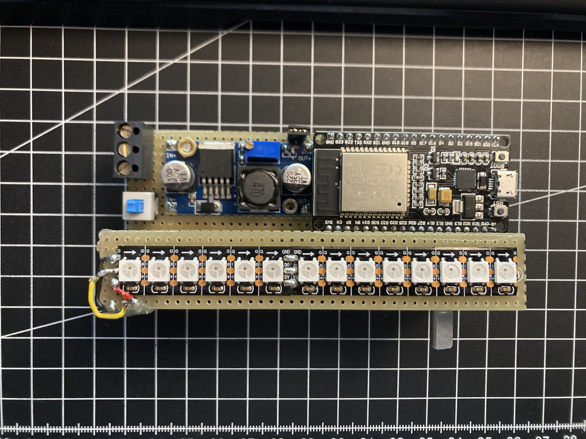

# LedThing
This a project with some Leds.
3D-Files can be found [here](3D-Files).

## Code
The Project was made using the PlatformIO Plugin in VSCode. Used Board: ESP32-DevKit V1
Built using the FastLED Library.

## 🖼 Images

